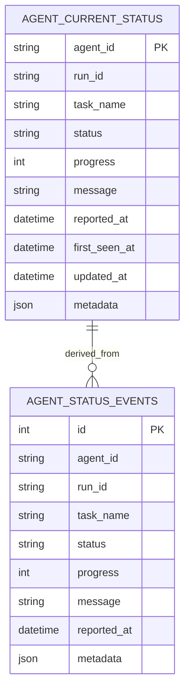

# feat: Add hybrid FastAPI agent monitoring server

## Overview

Build a Python-first monitoring system that lets agents report status through MCP-compatible server capabilities while humans observe the same state through a FastAPI web API, a lightweight browser dashboard, and a CLI monitor. The MVP should favor a single deployable FastAPI-based application with a shared application layer, durable SQLite-backed state, and a simple real-time browser experience.

## Problem Statement

The repository currently contains only a product sketch in `prd/init.md` and no implementation code, project conventions, or operational guidance. The existing concept proposes an in-memory status dictionary, an inline HTML dashboard, and a polling CLI, but it leaves critical product and architecture questions unresolved:

- in-memory state is lost on restart (`prd/init.md:160`)
- MCP transport and lifecycle handling are not specified
- browser and CLI read models are not formally defined
- auth, deployment, and multi-instance boundaries are missing
- testing and observability expectations are absent

Without a concrete plan, implementation risks locking the project into a brittle prototype that cannot recover state, stream updates reliably, or scale beyond a single happy path.

## Proposed Solution

Create a hybrid FastAPI application that owns the overall service lifecycle and exposes three surfaces backed by one shared domain model:

1. **MCP-compatible status ingestion** for agents
2. **REST + SSE web API** for dashboard consumers
3. **Polling CLI monitor** for terminal-based observation

The MVP should use:

- **FastAPI lifespan** for shared resource setup and teardown
- **FastMCP mounted into FastAPI** with explicit lifespan/session composition
- **SQLite in WAL mode** for durable current state and append-only event history
- **SSE for browser live updates** and **polling for CLI**
- **single-process / single-instance support** as the explicit MVP boundary

## Technical Approach

### Architecture

Use a modular monolith instead of a single-file prototype. Keep transports thin and move business logic into a shared service layer so MCP, REST, dashboard, and CLI all operate on the same rules.

Proposed logical structure:

- `app/main.py` — FastAPI app composition, lifespan, route mounting
- `app/mcp_server.py` — FastMCP setup and mounted ASGI integration
- `app/api/status.py` — REST + SSE endpoints for status reads
- `app/services/status_service.py` — canonical ingest/query logic
- `app/repositories/status_repository.py` — SQLite persistence layer
- `app/models/status.py` — validation schema and status enums
- `app/dashboard/templates/dashboard.html` or `app/dashboard.py` — minimal dashboard UI
- `cli/monitor.py` — read-only CLI monitor with watch mode and `--json`
- `tests/test_status_service.py`
- `tests/test_status_api.py`
- `tests/test_status_sse.py`
- `tests/test_mcp_integration.py`
- `tests/test_e2e_monitoring_flow.py`

### Core domain model

Define a canonical status model before implementation. Minimum fields:

- `agent_id`
- `run_id` or `task_id` to distinguish repeated work by the same agent
- `task_name`
- `status` (`queued`, `running`, `completed`, `failed`, `cancelled`, `stale`)
- `progress` (0-100)
- `message`
- `reported_at` (UTC ISO-8601)
- `metadata` (optional JSON for extensibility)

### Persistence model

SQLite should be the default MVP persistence layer because the repo has no existing data stack and research indicates it is the lowest-friction durable option.

#### ERD

### Realtime delivery

- **Browser dashboard:** load initial snapshot from REST, then subscribe to SSE for incremental updates
- **CLI monitor:** poll REST endpoints at a configurable interval with adaptive backoff when no changes are observed
- **MCP transport:** support documented, non-deprecated transport choices only; do not plan around deprecated standalone MCP HTTP+SSE

### Implementation Phases

#### Phase 1: Foundation

- Create project structure and dependency management files
- Define status schema, enums, and validation rules
- Add FastAPI app composition with lifespan-managed resources
- Add SQLite repository with WAL mode and schema bootstrap
- Decide and document MVP transport choice for MCP (`stdio` only vs `stdio` + Streamable HTTP)

Deliverables:

- `pyproject.toml` or `requirements.txt`
- `app/main.py`
- `app/models/status.py`
- `app/repositories/status_repository.py`
- `docs/plans/2026-03-20-001-feat-hybrid-fastapi-agent-monitor-plan.md`

Success criteria:

- App boots cleanly
- DB initializes automatically
- Canonical status payload is validated consistently

Estimated effort: 1-2 focused sessions

#### Phase 2: Core Implementation

- Mount FastMCP into FastAPI with correct lifespan/session integration
- Implement status ingest path through shared service layer
- Expose REST endpoints for snapshot and history
- Add SSE endpoint for browser updates
- Build minimal dashboard UI with empty, active, stale, and error states
- Implement CLI monitor with polling, filtering, and `--json`

Deliverables:

- `app/mcp_server.py`
- `app/services/status_service.py`
- `app/api/status.py`
- `app/dashboard/templates/dashboard.html`
- `cli/monitor.py`

Success criteria:

- Agent reports update both current snapshot and event history
- Dashboard reflects live changes without full-page refresh
- CLI remains usable during temporary API failures

Estimated effort: 2-4 focused sessions

#### Phase 3: Quality, Hardening, and Ops

- Add tests across service, API, SSE, MCP, and end-to-end flows
- Add auth/config/environment handling
- Add health checks, structured logging, and basic metrics hooks
- Document reverse proxy settings for SSE and production deployment
- Validate stale/offline derivation and retention behavior

Deliverables:

- `tests/test_status_service.py`
- `tests/test_status_api.py`
- `tests/test_status_sse.py`
- `tests/test_mcp_integration.py`
- `tests/test_e2e_monitoring_flow.py`
- `README.md`
- `.env.example`

Success criteria:

- Critical flows are covered by automated tests
- Production constraints are documented
- Security posture is explicit for hosted mode

Estimated effort: 1-3 focused sessions

## Alternative Approaches Considered

### 1. Single-file prototype (`server.py` + `monitor.py` only)

Rejected as the main plan because it is fast to start but makes lifecycle management, persistence, testing, and future transport changes harder to reason about.

### 2. Browser polling instead of SSE

Acceptable as a fallback, but not preferred for the dashboard because SSE provides a simpler real-time model for server-to-client updates while avoiding WebSocket complexity.

### 3. Full WebSocket architecture

Rejected for MVP because the current product need is primarily one-way status streaming. WebSockets add bidirectional complexity that is not yet justified.

### 4. In-memory-only state

Rejected because `prd/init.md` already identifies restart data loss as a limitation (`prd/init.md:160`), and recovery is important even for a demoable MVP.

### 5. Separate MCP server and separate web server

Rejected for MVP because a single FastAPI-owned runtime with mounted FastMCP is simpler to operate and better supports one shared application layer.

## System-Wide Impact

### Interaction Graph

Action flow should be explicit:

1. Agent sends status through MCP tool transport
2. MCP handler delegates to `app/services/status_service.py`
3. Service validates payload, writes event history in `agent_status_events`, updates `agent_current_status`, and emits update notifications
4. REST readers return current snapshot/history from the same repository
5. SSE subscribers receive incremental update events derived from the same write path
6. CLI polls REST and renders the shared read model

### Error & Failure Propagation

- Invalid payloads should fail validation before persistence and return structured errors
- DB write failures should surface as server errors and never partially update snapshot without event handling rules
- SSE disconnects should not affect writes; readers retry independently
- CLI network failures should degrade gracefully, showing retry status instead of crashing

### State Lifecycle Risks

- Partial failure between event append and current snapshot update can create divergence
- Out-of-order updates from the same agent can regress visible state if ordering is not enforced
- Stale/offline derivation can mark healthy agents incorrectly if thresholds are too aggressive
- Multi-worker deployment can break in-memory broadcasting assumptions

Mitigation:

- use transactional persistence where possible
- define ordering rules around `reported_at` and/or monotonic event IDs
- explicitly document single-instance MVP boundaries

### API Surface Parity

Any state visible in the dashboard must also be available through the REST API and CLI. Any agent write path available through MCP should use the same validation and service logic as future HTTP write paths.

### Integration Test Scenarios

1. `tests/test_e2e_monitoring_flow.py` — agent writes status, REST snapshot updates, SSE emits event, CLI-compatible JSON matches
2. `tests/test_restart_recovery.py` — write statuses, restart app, verify snapshot restoration from SQLite
3. `tests/test_stale_status_transition.py` — no updates past threshold, API and dashboard both mark agent stale
4. `tests/test_invalid_payload_rejection.py` — invalid status/progress rejected consistently across MCP path
5. `tests/test_sse_reconnect_behavior.py` — disconnect and reconnect produces usable live stream behavior

## Acceptance Criteria

### Functional Requirements

- [x] `app/services/status_service.py` provides a single shared ingest/query layer used by MCP, REST, dashboard, and CLI surfaces
- [x] Agents can report status through a supported MCP transport and persist both current snapshot and append-only event history
- [x] `app/api/status.py` exposes a snapshot endpoint and a history endpoint with documented response shapes
- [x] Browser dashboard loads the current snapshot and then receives incremental updates through SSE without requiring full-page refresh
- [x] `cli/monitor.py` can display current agent status in human-readable table form and machine-readable `--json` form
- [x] Agents with no updates for a configurable threshold are marked `stale` consistently across API, dashboard, and CLI
- [x] Invalid payloads (unknown status, out-of-range progress, malformed timestamps if accepted from clients) are rejected with clear error responses

### Non-Functional Requirements

- [x] SQLite runs in WAL mode for MVP durability
- [x] Report timestamps are normalized to UTC
- [x] CLI polling interval is configurable and supports backoff when idle
- [x] SSE works behind a reverse proxy with documented timeout and buffering settings
- [ ] Production mode requires explicit auth/TLS/origin policy decisions before public exposure
- [x] MVP explicitly documents whether support is limited to single-process/single-instance

### Quality Gates

- [x] Automated tests cover service logic, REST API, SSE, MCP integration, and end-to-end flow
- [x] Health check and startup failure modes are documented
- [x] README includes local run instructions for server, dashboard, and CLI
- [x] AI-generated implementation output, if used, is called out for human review in critical lifecycle/security paths

## Success Metrics

- Local developer can start the server and observe status updates end-to-end in under 10 minutes
- Restarting the app preserves the last known agent snapshot
- Browser dashboard shows status changes within an acceptable near-real-time window for MVP (target: under 2 seconds after persistence when SSE is active)
- CLI remains operational during transient API errors and recovers automatically
- Test suite covers the primary ingest/read/recovery flows before the first public deployment

## Dependencies & Prerequisites

- Decision on dependency management format (`pyproject.toml` preferred, but not yet established in repo)
- FastAPI, Uvicorn, and FastMCP compatibility validation
- SQLite availability in local and hosted target environments
- Clear decision on auth scope for:
  - agent writers
  - browser readers
  - CLI readers

## Risk Analysis & Mitigation

| Risk | Why it matters | Mitigation |
| --- | --- | --- |
| Deprecated MCP transport assumptions | Planning against old HTTP+SSE behavior can create rework | Use supported MCP transports only and document them explicitly |
| Lifespan/session misconfiguration when mounting FastMCP | Can break MCP session initialization and teardown | Make lifecycle composition a Phase 1 design checkpoint |
| In-memory broadcast assumptions fail in production | Breaks multi-worker or multi-instance behavior | Declare single-instance MVP boundary and revisit fan-out later |
| Overly minimal schema | Leads to ambiguous state transitions and poor testability | Define status enum, timestamp, stale rules, and task/run identity up front |
| Dashboard complexity creep | Risks delaying MVP | Keep dashboard table-focused; defer detail pages and advanced filtering |
| Security under-specification | Hosted dashboard may expose internal agent activity | Require auth/origin/TLS decisions before public deployment |

## Resource Requirements

- One engineer comfortable with Python/FastAPI async patterns
- Optional reviewer for deployment/security concerns
- Local SQLite-backed development environment
- Hosted environment capable of running ASGI app behind reverse proxy if public dashboard is desired

## Open Questions

### Critical

1. Is MCP support required only for local `stdio`, or also for remote Streamable HTTP clients?
2. What auth model should protect agent writes and human reads?
3. Is the MVP allowed to be explicitly single-process/single-instance?
4. Should `agent_id` represent one long-lived actor, while `run_id` tracks individual tasks, or is a flatter model acceptable?

### Important

1. Does the browser need replay from `Last-Event-ID`, or is fresh live streaming sufficient for MVP?
2. How long should event history be retained in SQLite?
3. Should the CLI support only watch mode, or also historical inspection and filtering from day one?
4. Are per-agent detail views needed, or is a single dashboard table enough?

## Future Considerations

- Multi-instance fan-out using shared pub/sub or DB-backed event distribution
- Per-agent detail pages and richer filtering
- Exportable audit/history views
- Role-based access control (`viewer` vs `operator`)
- Optional WebSocket transport if the browser later needs bidirectional controls

## Documentation Plan

- Add `README.md` with setup, run, and architecture overview
- Add `.env.example` for host/port/auth settings if env-driven config is introduced
- Document MCP transport choice and hosted deployment model
- Document SSE proxy configuration and stale/offline semantics
- Record any important implementation learnings in `docs/solutions/` once the feature is built

## AI-Era Considerations

- Implementation can move quickly with AI pair programming, so the plan should emphasize transport correctness, lifecycle management, and end-to-end tests over raw coding speed
- Prompts that proved useful during planning should be preserved in implementation notes if they help future contributors audit design decisions
- Any AI-generated lifecycle, security, or persistence code should receive explicit human review before deployment

## Sources & References

### Internal References

- Product description and initial prototype sketch: `prd/init.md:1-163`
- Hybrid server concept: `prd/init.md:13-89`
- CLI concept: `prd/init.md:94-125`
- Persistence limitation note: `prd/init.md:159-161`

### Institutional Learnings

- Async session/context pattern reference: `/Volumes/js_drive/Projects/patent_space_apps/worktree/back/new-plan-biz-plus/core/db/session.py`
- Non-blocking polling reference: `/Volumes/js_drive/Projects/patent_space_apps/worktree/back/new-plan-biz-plus/core/helpers/celery_helper.py`
- CLI/config pattern reference: `/Volumes/js_drive/Projects/patent_space_apps/worktree/back/new-plan-biz-plus/main.py`
- Async test setup reference: `/Volumes/js_drive/Projects/patent_space_apps/worktree/back/new-plan-biz-plus/tests/conftest.py`
- Monitoring backoff reference: `/Volumes/js_drive/Projects/x-trading/docs/solutions/logic-errors/`

### External References

- FastAPI lifespan: https://fastapi.tiangolo.com/advanced/events/
- FastAPI background tasks: https://fastapi.tiangolo.com/tutorial/background-tasks/
- FastAPI SSE: https://fastapi.tiangolo.com/tutorial/server-sent-events/
- FastAPI WebSockets: https://fastapi.tiangolo.com/advanced/websockets/
- FastAPI testing: https://fastapi.tiangolo.com/tutorial/testing/
- FastAPI testing lifespan events: https://fastapi.tiangolo.com/advanced/testing-events/
- FastAPI deployment concepts: https://fastapi.tiangolo.com/deployment/concepts/
- Starlette lifespan: https://www.starlette.io/lifespan/
- Starlette responses: https://www.starlette.io/responses/
- Starlette TestClient: https://www.starlette.io/testclient/
- Uvicorn settings: https://www.uvicorn.org/settings/
- Uvicorn lifespan concept: https://www.uvicorn.org/concepts/lifespan/
- MCP specification: https://modelcontextprotocol.io/specification/latest
- MCP transports (2025-03-26): https://modelcontextprotocol.io/specification/2025-03-26/basic/transports
- MCP Python SDK README: https://github.com/modelcontextprotocol/python-sdk/blob/main/README.md
- FastMCP HTTP deployment: https://gofastmcp.com/deployment/http
- FastMCP FastAPI integration: https://gofastmcp.com/integrations/fastapi
- MDN SSE usage: https://developer.mozilla.org/en-US/docs/Web/API/Server-sent_events/Using_server-sent_events
- OpenTelemetry Python: https://opentelemetry.io/docs/languages/python/getting-started/
- Prometheus overview: https://prometheus.io/docs/introduction/overview/
- Sentry FastAPI integration: https://docs.sentry.io/platforms/python/integrations/fastapi/

### Related Work

- No repo-local issues, PRs, or prior implementation files were found during research
